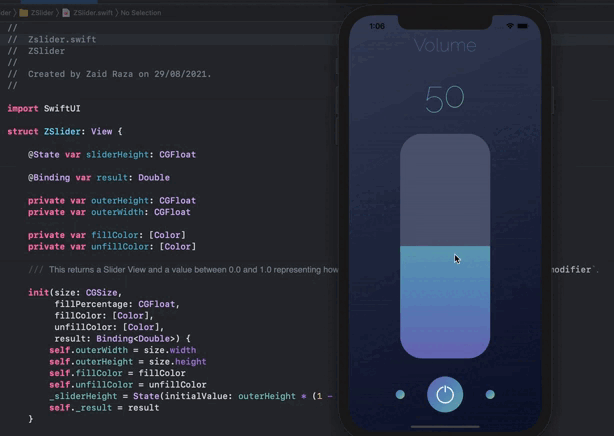

# ZSlider

### A reusable Slider View made with SwiftUI.

---

# Application Gif





### Installation:

Minimum version iOS 13

In Xcode go to `File -> Swift Packages -> Add Package Dependency` and paste in the repo's url: `https://github.com/ZaidRaza26/ZSlider` and select main branch.

### Usage

Import the package in the file you would like to use it: `import ZSlider`

```swift
struct ContentView: View {
    @State private var result = 0.0
    
    var body: some View {
        ZSlider(size: CGSize(width: 200, height: 500), fillPercentage: 0.4,
                fillColor: [Color(red: 110/255, green: 110/255, blue: 185/255), Color(red: 93/255, green: 145/255, blue: 190/255), Color(red: 113/255, green: 180/255, blue: 178/255), Color(red: 185/255, green: 204/255, blue: 126/255)],
                unfillColor: [Color(red: 83/255, green: 92/255, blue: 118/255)], result: self.$result)
            .onChange(of: result) { newValue in
                print(newValue)
            }
    }
}
```

